# Gjallarhorn Postmortem

It’s a dangerous business, Frodo, making a game. You open up your editor, and if you don’t limit your scope, there’s no knowing where you might be swept off to.

1. [Theme](#theme)
2. [Prototype](#prototype)
3. [Graphics](#graphics)
4. [Puzzles](#puzzles)
5. [Audio](#audio)
6. [Polish](#polish)
7. [Odds and Ends](#odds-and-ends)
8. [Handmade Disclaimer](#handmade-disclaimer)
9. [Acknowledgements](#acknowledgements)

## Theme

For [JS13K 2026](https://js13kgames.com/2026/), I tried my hand at making a puzzle game. Many of the games I have worked on include puzzle aspects, but they usually fall back on procedural level design as a crutch, probably because I don't feel smart enough to design genuinely engaging challenges.

When the "Unicorns & Rainbows" theme was announced I bounced around between between ideas about cracking passwords with unicode and rainbow tables, and the [mythological Norse rainbow bridge](https://en.wikipedia.org/wiki/Bifr%C3%B6st) that links Asgard to Midgard. After having recently built [Smolitaire](https://codeberg.org/danprince/smolitaire) as a pre-theme warmup, I spent a good chunk of time trying to create a Bifrost themed solitaire variant, which used runes instead of face values, and seven colors instead of suits.

I never managed to find an interesting game within those ideas, but I did spend a good deal of time reading about Norse mythology, and when I learned that [Heimdall](https://en.wikipedia.org/wiki/Heimdall), the guardian of the Bifrost, has a magical "[Gjallarhorn](https://en.wikipedia.org/wiki/Gjallarhorn)" I spotted the opportunity for the "unique horn" pun and couldn't stop myself from running with it.

I try and stay on paper for as long as possible during this stage, partly because I have better ideas when there are fewer distractions, and partly because freehand helps me steer clear of traps and cliches that are easier to fall into once I'm working with code or pixel art. Here's the first set of sketches and notes that would eventually go on to become Gjallarhorn.

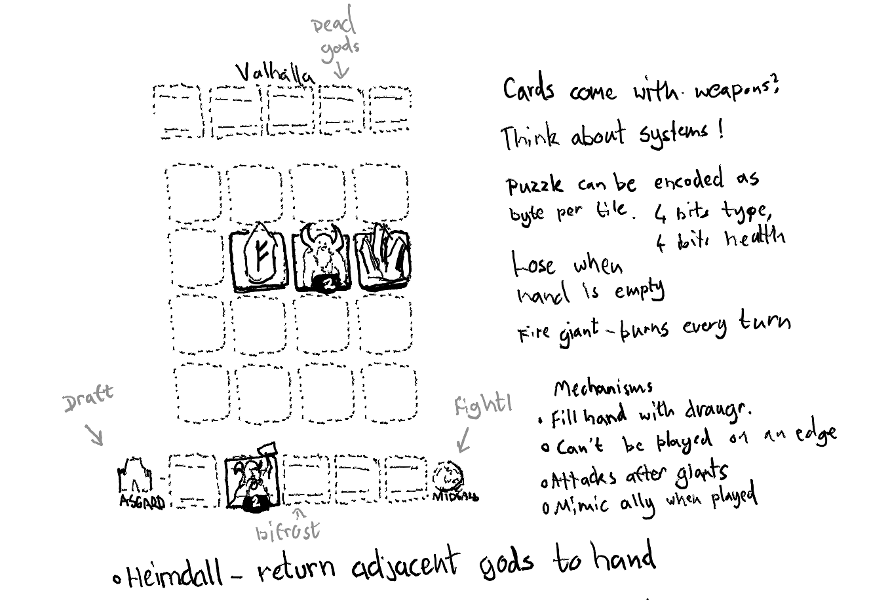

In the mythology, Heimdall guards the rainbow bridge from the [jötnar (giants)](https://en.wikipedia.org/wiki/J%C3%B6tunn) who became the game's natural antagonists. I imagined the player drafting a small selection of gods in Asgard, then using them to do battle on the Bifrost in order to complete each puzzle.

## Prototype

If the sketching phase is about figuring when there's a game within an idea, then the prototyping phase is about figuring out whether there's any fun within a game, which is great, because I love building prototypes! I love sharing them as early as possible for feedback, and I love the liberating feeling that comes with completely throwing them away!

A couple of days later, and I had a [playable prototype](https://prototype.gjallarhorn-3pc.pages.dev/). You can actually still play it, although there's only one puzzle and it's extremely easy.

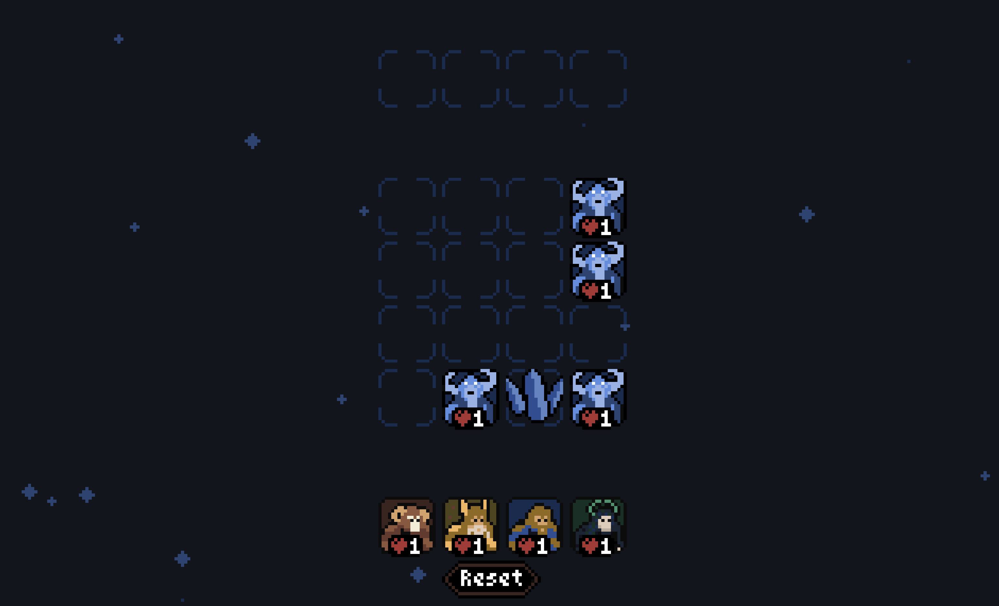

The prototype became a testing ground for the mechanics I'd envisioned. It served as the brutal chopping block for ideas like cards having items, or drafting a deck on another screen. It forced me to dramatically tune down the complexity of the card effects because it's just too hard to communicate them effectively and precisely.

I _think_ this year marks the tenth time that I've tried to build a game for JS13K, but only the second time that I ended up with something that I was happy to submit. What I've learned is that the essence of the game needs to be simple enough that I can build it in a day or two, because it _will_ take me the rest of the month to tune, balance, polish, and shrink it down to 13KB.

Although this prototype is close to mechanically complete, it lacks all of the substance that makes it feel like a real _game_. It served its purpose by demonstrating that this game can be fun, and after honouring it with the "initial commit" message, I threw it away and restarted the design and implementation from scratch.

## Graphics

I have [aphantasia](https://en.wikipedia.org/wiki/Aphantasia) which means that I can't visualise things in my head. That's a unique challenge for the design, because it means that I never really have a "vision" for a game. Each step of the way involves starting with jsomething that looks bad and tweaking it until one of the tweaked versions looks better, and so on. Over time, my intuition for _what_ to tweak has improved a lot, but I still spend a lot of time stumbling around in the figurative darkness.

Pixel art may be the ideal medium for us aphantasics, because the tiny resolutions make it possible to dramatically alter the look and feel of a picture with two or three clicks. I'm still stumbling around, but I feel like I'm stumbling very efficiently. Pixel art is also a great medium for JS13K because it's the only raster graphics format that has any hope of fitting within the game's overall budget.

Whilst one hemisphere of my brain dives back into lower level engine work and effect systems, the other is pushing pixels around trying to create a mockup of the finished game. It's a huge motivational boost for me when I see that first hypothetical screenshot, but I also tend to discover a lot of visual constraints that will impact the mechanical design during that process.

I was fairly happy with the hand/board/grave anchors, but I needed to ground them so that they didn't feel like the game was happening on an abstract plane. I keep all of my visual notes around and whilst writing this postmortem I went back and counted over 50(!) attempts to design something that felt like a cohesive game. If that sounds ridiculous, that's because it is! Here's a selection of a few of the designs that felt a bit more cohesive.

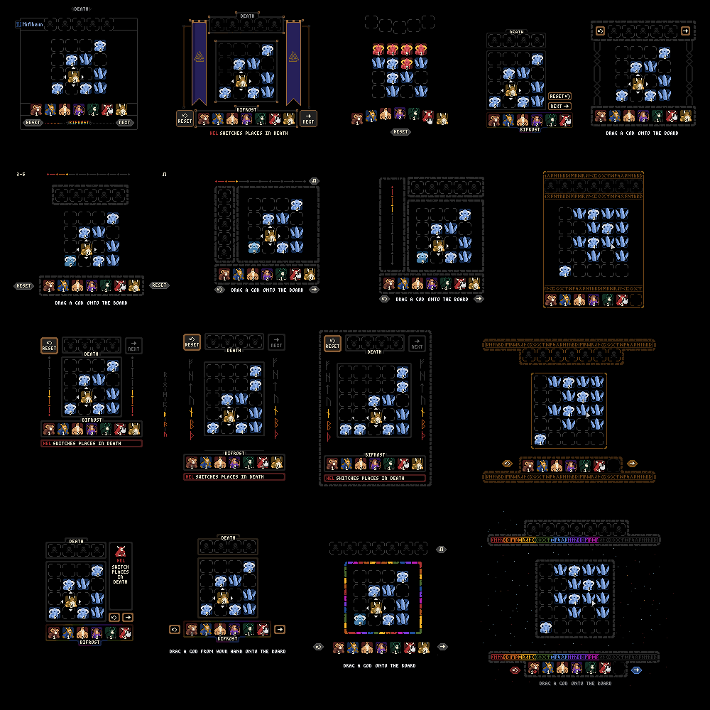

I don't normally find this process anywhere near as difficult, but I was probably stalled here for the best part of a week and nearly abandoned the idea entirely during this stasis. Every design that failed to incorporate the rainbow bridge felt like a waste of a visually iconic theme, but then every design that made more extensive use of the full color spectrum ended up feeling garish and ugly.

I tried to pivot into having the characters themselves embody the rainbow colors, so that I could take some pressure off the rest of the user interface. Initially that was with some [Haque](https://supertry.itch.io/haque) inspired gods, but I don't feel like I understand that 1-bit aesthetic well enough to really succeed with it.

I also tried some larger versions of the prototype sprites, and an additional set of gods drawn directly from some portraits online. I'm happy with how the larger characters turned out once I turned them into cards, but I began to miss the goofy little guys from the prototype and they ended up making their way back to center stage.

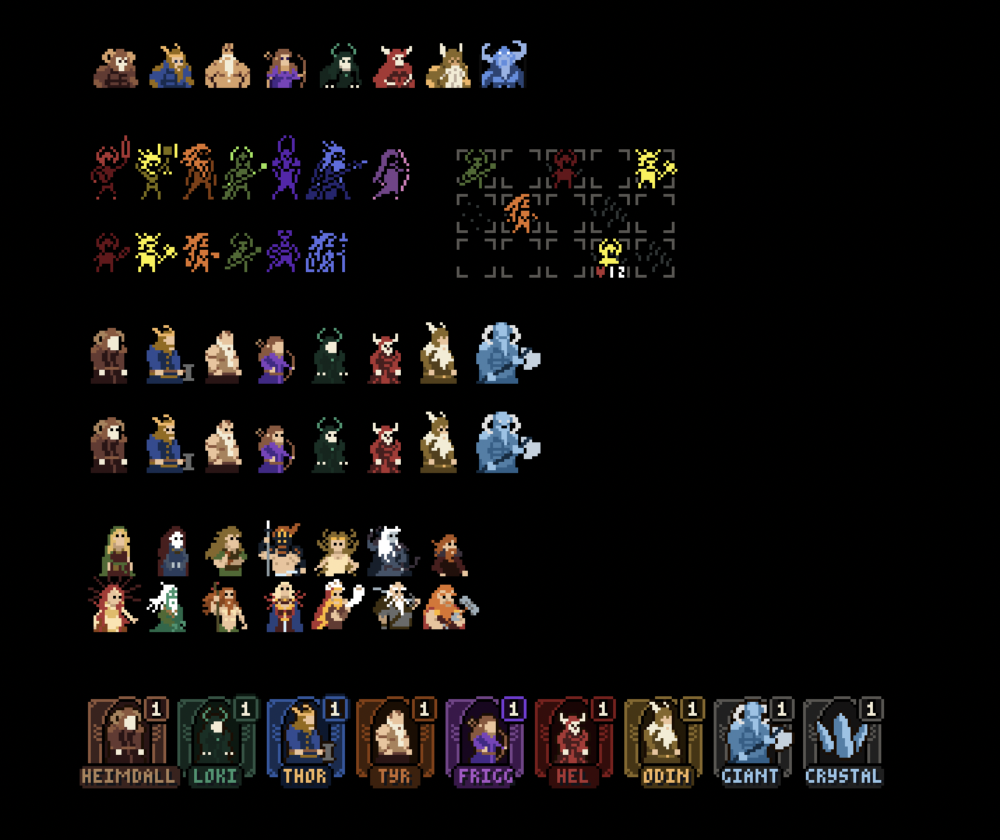

According to Wikipedia, there's some debate around whether or not the Bifrost originally represented the Milky Way instead of rainbows and during a celestial moodboarding session, I managed to break the design deadlock with some inspiration from [this image](https://www.shutterstock.com/image-vector/space-background-2d-games-game-level-2389375935) that inspired the current amorphous band of nebulous stuff that floats through the background the scene.

Originally, it flowed right behind the board, which caused a fair bit of visual noise during gameplay, so it wasn't long before the board got a background and that's when everything started to come together visually.

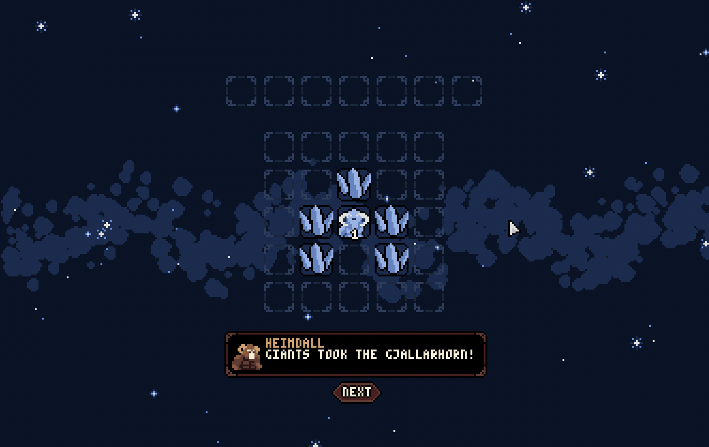

Drawing a static background like this isn't really an option. The pixel resolution of the image above is around 380x240 and an image that size will immediately eat a big chunk of a 13KB budget. Thankfully, I didn't want it to be static and creating a version from procedural animation takes much less space.

I did a few rounds of iteration before reaching the finished design, but the version you see in the game now is [rendered by quite a simple function](https://github.com/danprince/gjallarhorn/blob/de40c0a3d64980f00746ad746daa00dc4379f213/game/game.js#L1374-L1394). There are three sizes of blob sprites, and I'm rendering 500 of them at random positions along a sine wave to make the "bridge" you see in the sky behind the board.

I got a lot of value out using pseudorandom number generators to make stateless versions of these kinds of effects (which is a trick that I picked up from reading the source of some [ShaderToy](https://www.shadertoy.com/) examples). This approach prevents you from doing something like collisions or dynamic additions or removals, but if you don't need the individual particles to interact, you can save quite a few bytes here.

Even at a low resolution, pixel art is typically far more expensive than code. You can expect code to compress extremely well because it's full of strict repetitive structures that [LZ77](https://en.wikipedia.org/wiki/LZ77_and_LZ78) is going identify and reduce for [DEFLATE](https://en.wikipedia.org/wiki/Deflate) when you zip the game. A PNG spritesheet, on the other hand, is a far more chaotic jumble of colors and patterns.

This year's spritesheet was a little smaller than previous editions, but I made extremely heavy use of palette swapping to try to keep the game feeling visually rich. The final version clocked in 128x81 pixels, but honestly I probably could have shrunk it down a fair bit further, had I been prepared to mess with the layout.

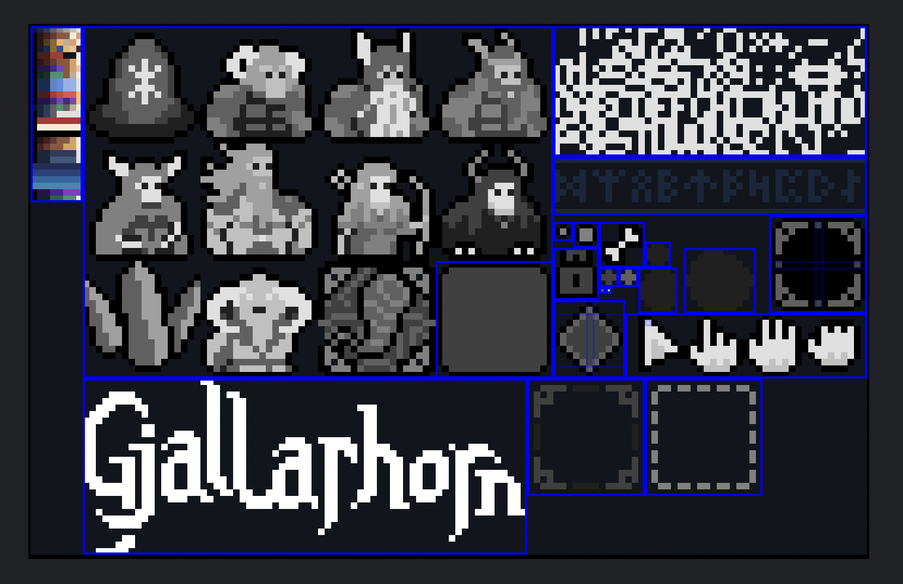

One of the first things you'll notice is that the sprites are mostly drawn in greyscale. The jumble of colored pixels in the top left defines the palettes that the game can use so each draw call passes along a palette index so that the game's renderer knows how to color the sprite. A palette swap is much easier to set up if you're programming for a GPU with a fragment shader that can sample and map pixels in parallel every frame, but for canvas 2D, it's arguably a bit more fiddly.

There are lots of ways you can set up a palette swap. In the past I've made games that define their swaps in code with a mapping from source pixel colors to target pixel colors, which allows you to paint using natural colors. The associated cost is that half of the artistic process now involves tweaking numbers in a text editor instead of in graphics software with immediate feedback. Another approach is to draw using predefined color stops (e.g. red maps to color 0, blue maps to color 1, ...). You could also just use a single channel of RGBA to store the palette index (e.g. `#000001` is color 1, `#000002` is color 2, ...) but for the human eye, it's effectively impossible to tell the difference between those colors, which really hurts your ability to iterate on the artwork.

The approach I settled on was to use equally spaced greys (`#000000`, `#202020`, `#404040`, `#606060`, ...) which have two desireable properties. Firstly, I can still see what I'm doing whilst I make changes to the spritesheet, and secondly, you can rightwards bit shift the individual channel components to turn them back into 0-based indexes.

```js
0x00 >> 5 === 0;
0x20 >> 5 === 1;
0x40 >> 5 === 2;
0x60 >> 5 === 3;
```

Depending on how your brain thinks about binary representation, it might be more intuitive to see that bitshift as `/ 32`.

Doing this process on the CPU is many orders of magnitude slower than it would be on the GPU where you can easily afford to do it during every frame. Instead, I build these textures once upfront as the game loads.

That process involves fetching the spritesheet, reading the raw pixel values, then creating a canvas for each palette, iterating over each source pixel, reading the red component, shifting it right, mapping that index into the current 8 color palette, and writing the mapped pixel into the new canvas. If that still sounds scary, I encourage you to check out the [30 lines of code](https://github.com/danprince/gjallarhorn/blob/de40c0a3d64980f00746ad746daa00dc4379f213/game/graphics.js#L20-L51) that makes it happen.

Historically, palette swaps were used extensively as a way to create more content when the texture budgets were already maxed out, and you'll notice that if you make it to the levels with Fire Giants and Chaos Giants.

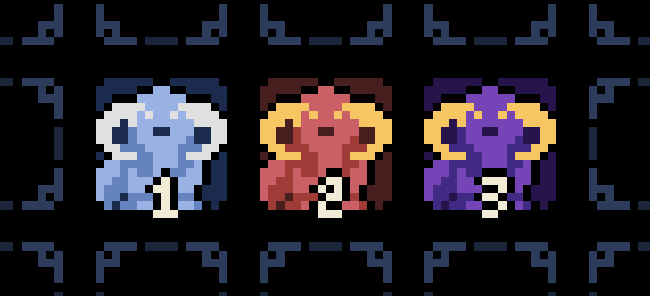

But why stop there? If I slow things down then you'll see that when a card attacks another card there's a visual flash where the card turns red. That's a palette swap to a red palette!

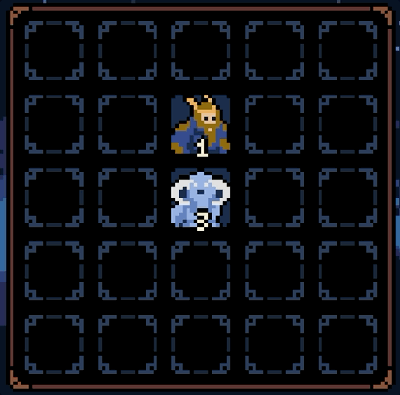

How about the levels where certain gods are locked? That's a palette swap to a black palette!

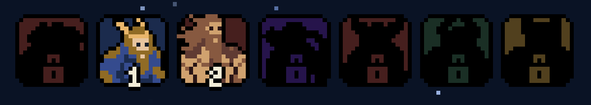

Or the fact that each god has their own dialogue frame colors? Palette swap!

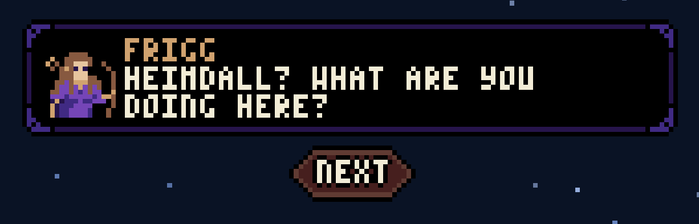

Different styles of buttons? Buttons that light up on hover? Colored text? Palette swap! Palette swap! Palette swap!

I've rambled about pixel fonts in the past so I'll try not to detour too hard here, but the jumble of white shapes in top right corner is a 3x5 pixel font with no padding. I have strong feelings about not ruining low resolution aesthetics with vector fonts, so raster fonts are the only real option.

I did end up down a bit of a rabbit hole when I tried to shrink the font down even further by packing the separate glyphs into the different RGB channels, but every version of the decoder ended up costing more bytes than I saved from the packing. I suppose that the PNG's own DEFLATE pass is much better at finding and reusing common sequences with the 1-bit version.

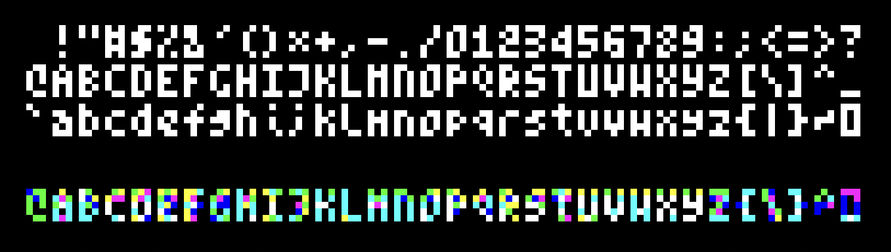

The final spritesheet is 2045 bytes, which [`optipng`](https://github.com/oxipng/oxipng) manages to trim down to 1925, saving a non-negligible 120 bytes. Interestingly, because the PNG format already performs a DEFLATE compression pass, there's a 0% reduction in file size when the PNG is added to the final zip file, so the spritesheet ends up taking up exactly 14.46% of the overall 13KB budget. I was able to save a few more bytes with [pngquant](https://pngquant.org/) but this ended up messing with my palette swapping, so I had to remove it.

## Puzzles

With everything looking ship-shape, I moved my attention back to the puzzle design space in order to attempt to carve out the game's basic progression and puzzle sequencing. I can hold my hands up here and say that I basically have no idea what I'm doing!

The guiding rule I used was to avoid design-space redundancy at all costs. Let's imagine that the first god hits for ten points of damage and the second god hits for twenty. Assuming you can only play one, then you pick the second god every time (unless there's some niche reason to try to target a specific amount of HP). Any time you introduce an option that is strictly better than a previous option, strategy effectively degenerates.

The design for the gods came from me thinking about simple ideas that I thought would combine in interesting ways. Here's the set of powers that existed in the prototype.

- **Heimdall** returns adjacent allies to the hand.
- **Thor** smashes crystals.
- **Tyr** attacks push giants.
- **Frigg** attacks diagonally.
- **Hel** hits for each card in the grave.
- **Loki** returns to the hand if he kills a giant.
- **Odin** spear pierces through enemies.

Some of those powers made it to the final game but others took real work and playtesting to get right. Compared to many similar puzzle/strategy games, Gjallarhorn is a bit odd. You play a card, then that's it. There are no actions available for cards that are in play. That meant that Heimdall being able to recall cards was effectively the only engine for gameplay sequences that involved playing a given god twice. That felt way too linear for interesting puzzles, and so Tyr's push was quickly changed to also apply to gods, in order to add another channel for replays.

I tried to give Hel a similar rework, which involved her trading places with the leftmost card in the grave when she dies, replaying them on her original slot, however this often ended up requiring some pretty tedious planning in order to kill a useful god immediately to set her up. Leftmost was swapped to rightmost, then rightmost became rightmost god, and I eventually reverted back to her original mechanic.

Loki was (appropriately) a bit of a nightmare. The version that returned to your hand after slaying a giant was way too strong for a game where the hitpoint numbers are quite small. Most puzzles deteriorated into having Loki do a boring glory lap to mop up a load of 1HP giants. I experimented with versions where he'd leave a crystal behind when returning, a version where he also attacks gods, a version where he's technically a giant, and eventually settled on giving him an attack that would "echo" if he killed a giant.

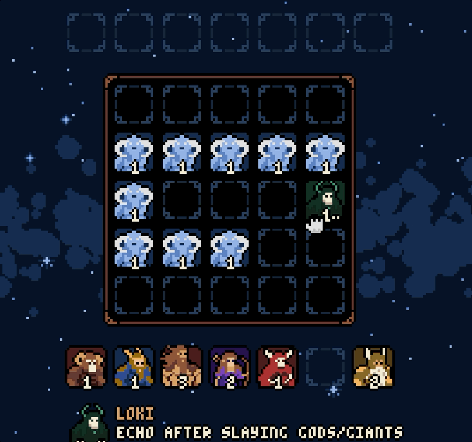

It felt fun, it looks cool, and it made for some of the most boring puzzles that I designed throughout the whole month. The Loki puzzles were super easy to spot because they always involved big clumps of connected giants and it was typically trivially easy to spot and exploit them. It was also extremely difficult to accurately explain his effect in the tooltip.

From the perspective of the lore, I really liked the idea of sowing the seed that as a trickster, Loki might be working with the giants and that idea spawned the "swap" mechanic that he currently has. Instead of attacking giants, he simply swaps his adjacent cards, and that "movement" gives you another engine for replaying gods, and removing those pesky crystals when Thor isn't available.

This design is problematically exploitable because of the way it interacts with Heimdall's power to recall gods back to the hand. Play Heimdall, use Loki to swap him, which causes Heimdall to recall Loki, rinse and repeat until every god has been recalled and every giant is dead. I wondered about making a hidden exception for Loki that would prevent him from being recalled, but ultimately decided to just limit the number of puzzles where Loki and Heimdall appear together.

As the final character reveal, Odin also took a lot of work to get right. Earlier iterations of the game included runestones as part of the level designs (now you know why the tutorial sprite is a runestone) and the first interesting version of Odin added a runestone to your hand. After having seen them throughout the game, it felt particularly impactful to suddenly be able to create them. Unfortunately, it also creates another logical loophole. Play Odin to create a runestone, play the runestone next to Odin to create another runestone, recall him with Heimdall, and repeat until you have as many runestones as you need. I don't really mind there being exploits so long as they are difficult to find and hard to pull off, but these just trivialised the late game puzzles.

He pivoted again into simply replaying adjacent when he was played, which felt great until I played him next to Loki and watched the game get stuck in an infinite series of swaps and replays. Ultimately I decided to remove runestones in favour of bringing the Gjallarhorn to its rightful place in the finale, and just deciding to make a hidden exception so that Odin can't be replayed via the Gjallarhorn.

I imagine these many of these puzzling woes are largely rookie mistakes that I would grow out of making with more of these kinds of games under my belt, but boy, this was a frustrating chapter of the game! So many of the balancing changes broke existing puzzles in unexpected ways. Looking back, I probably should have built some kind of automatic solution verification tests, to catch these kinds of regressions.

One of the best decisions I made all month was the decision to build a puzzle editor into the game directly and to ensure that any puzzle could be shared via a URL. When you are in the editor mode (add `?edit` to the game's URL) you can spawn and modify cards in the slot below the cursor using keyboard shortcuts, these edits sync back to state within the URL itself, so you can begin designing a puzzle, play through it, hit reset, make a change in your text editor, reload the game, and carry on designing from the point where you last made an edit. I don't really even want to think about the amount of time I saved like this, compared to a version where I edited the levels in text files.

The URL encoding for levels is the same as the encoding I use within the game's source:

```js
// Prisoner
// Teach the player to use Thor to smash crystals and Heimdall to return him
// to the hand.
3: [
  "------I0I0I0--I0J2I0--I0I0I0",
  [HEIMDALL, THOR],
  [TUTORIAL, "EACH GOD HAS A POWER THEY\nUSE AFTER ATTACKING"],
  [TUTORIAL, "CHOOSE THE ORDER OF PLAY\nWISELY"],
],
```

Each cell of the 5x5 board is encoded into one or two characters. If the cell is empty, it encodes as `-`, if there's a card in it, it encodes the card's ID as a character of the alphabet. Finally, trailing `-` are stripped.

If I add some line breaks and space based padding, then the encoded level above becomes much easier to visualise.

```
-  -  -  -  -
-  I0 I0 I0 -
-  I0 J2 I0 -
-  I0 I0 I0
```

Fun fact! It's silly, but I actually lined up the card ID ordering so that the ice crystals would encode as `I` and giants (jotunn) would encode as `J`.

In theory, I can also snapshot the current state of a game at any point in time, to send it to someone else, or vice versa in order to track down a bug. I didn't end up needing this but hey, if I had, it would have been _cool_!

## Audio

With the gods and the puzzle designs finally coming together, I turned my attention to what became the biggest rabbit hole of the entire project. The music. I could probably go on such a deep dive here that it would be worth its own postmortem but I'll see how much I can cover without derailing the whole train of thought.

My [last entry](https://js13kgames.com/2022/games/norman-the-necromancer) to JS13K used procedurally generated music, which I thought would a great way to break up the monotony for me whilst building the game, which turned to be absolutely true, but during the voting stage I realised that the vast majority of players only did one run, and they assumed the version they heard was "_the_ soundtrack".

I was extremely inspired to return to procedural music by Nifflas' [Music Algorithm Showcase](https://www.youtube.com/watch?v=WbgdXalXPus) but for the sake of variety (and what I thought would be simplicity) I ended up deciding to put those years of noodling to the test and write the music myself instead.

I've messed around with using raw data for step sequencing before, which is great for bytes, but terrible for musical expression and feedback, but it works as a starting point for hearing something coming out of the speakers.

For example, I could write a bassline like this:

```js
const BASS = [A3, 1 / 4, A3, 1 / 4, D3, 1 / 8, C3, 1 / 8, _, 1 / 4];
```

In this syntax A3 represents the musical note A being played at a specific pitch, and the fractional value after represents the amount of the time that it should occupy. There are a lot of problems with using 32 bit floating point values for this but that's a post for another time. The `_` denotes a musical "rest".

There are quite a few problems here and they become more and more apparent as the musical ideas get more complex.

First, polyphony is impossible. There's no way to have two notes sound together on one track. For a bassline, that's probably fine, but if you want pads playing chords, or synths playing in harmony, then you must split them out onto different tracks and that becomes very difficult to keep in sync.

Second, these sequences only really read horizontally. Let's look at another example:

```js
const BASS = [A3, 1 / 4, A3, 1 / 4, D3, 1 / 8, C3, 1 / 8, _, 1 / 4];
const KICK = [C2, 1 / 4, _, 1 / 4, C2, 1 / 4];
```

Are these patterns the same length? Do the kick drum beats line up with the same beats that the bass notes play? You don't even need to know how to read music to recognise that questions like these are easier to answer with staff notation than with code, because rhythm and timing is an integral dimension of the format.

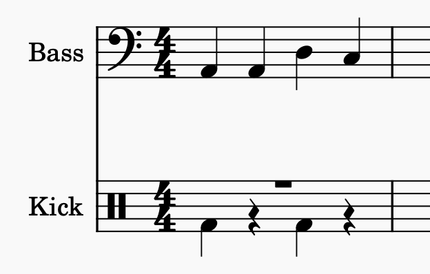

There are notations like ABC which attempt to convey the same degree of musical meaning with a simpler ASCII based format, but it's still a pretty awkward format to parse and compose music in.

Even simpler still (at least for editing) is [MIDI](https://en.wikipedia.org/wiki/MIDI). The MIDI format itself is effectively just a continuous stream of discrete events. For example, if I press the D4 key on a MIDI controller, that controller fires `0x0 0x90 0x3e 0x3f` over the wire, which in MIDI speak means:

- `0x0 = 0` pulses since the previous event.
- `0x90 = 144` is the "note on" event type for MIDI channel `0`.
- `0x3e = 62` is the MIDI note index for D4.
- `0x3f = 63` is the pressure I used to when depressing the key.

However, MIDI isn't just for live performances. You can record a list of events into a file, or even just create them from scratch with MIDI editing software.

Unlike a WAV, or OGG, or MP4 which all contain the frequencies you need to recreate a recorded sound, MIDI doesn't know anything about sounds, it just cares about numbers, which makes it a great format for composing digital music.

Here's the same musical phrase scored again in two tracks of MIDI. The individual events turn very neatly into little blocks that you can drag up or down to make the notes higher or lower, or move left and right to make them happen sooner or later within a piece of music.

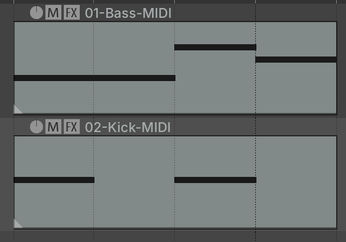

I can already sense the imminent danger of this postmortem becoming a MIDI deep dive, so I'll try to cut to the chase. I composed a piece of music for my game using a piece of software called Guitar Pro, which has a MIDI export. For reasons I could not fathom, Guitar Pro would randomly break my 3 instruments into either 7-8 MIDI tracks (each track is a separate sequence of MIDI events). It would always create a master track which contained the top level metadata for timing and global events, but then sometimes it would take just end a track at a random location and put the rest of the notes onto the subsequent track.

Despite a quick and ill-fated detour through [MuseScore](https://musescore.org/en) I ended up back in [REAPER](https://www.reaper.fm/), another piece of software that I'm very familiar with, but haven't had a reason to touch for a few years now. REAPER gives you direct control over the MIDI events for each track, which allowed me to trim any cruft and pick exact values and patterns that I knew would end up would compressing well.

The music itself was born out of a sketch from my phone's recorder that was saved as "Humming in a shopping mall" which is just a clip of me humming a melody whilst I was waiting for a friend in a shopping mall somewhere in Spain. I often make these kinds of musical ideas, never entirely sure when or if I'll use them, but here we are! I'll attach the original audio here if you're curious.

<audio src="hiasm.m4a"></audio>

(I have no idea whether an audio tag will render in markdown, so here's [a link](hiasm.m4a) as a fallback).

And here's how the final score sounds in the game (the humming melody comes in around the 1:35 mark).

<audio src="ragnarok.webm"></audio>

([fallback link](ragnarok.webm))

Musically, there's nothing particularly interesting going on. I tried songs with richer melodic content, but the focus on drums and the drone notes felt a lot more appropriate for a Norse game. I actually ended up composing four separate tracks for this game and throwing away the ones that didn't capture the feeling I wanted them to.

I chucked together a [hacky MIDI parser](https://github.com/danprince/gjallarhorn/blob/de40c0a3d64980f00746ad746daa00dc4379f213/game/audio.js#L312-L356) that basically just ignores all of the MIDI events that I know my track doesn't contain. Technically there's still some redundant data within the MIDI format for this song specifically, nothing is using channels, drum hits don't care about note off events, and the MIDI headers are irrelevant here, but as a compact binary format, it still beats any textual encoding you're going to fit into JavaScript and best of all, it compresses like a dream. The raw MIDI file in my game is 7022 bytes, but because most of the musical phrases and rhythms are repeated, it gets a whopping 89% compression reduction, taking it down to just 772 bytes! It's a 3:43 song and it takes up less than 6% of the total budget.

Because MIDI has no sound data attached, after parsing it, it's your job to wire it up to something that can actually produce the notes. During composition, I have it playing through a wavetable synthesizer called [Vital](https://vital.audio/) which allows me to mimic the functionality of some of the Web Audio API nodes. Then at runtime it's time to connect everything up to raw oscillators and [PCM](https://en.wikipedia.org/wiki/Pulse-code_modulation) samples.

I should preface the next section by saying categorically that using the Web Audio API makes me sad (and I don't think that's because of a skill issue). The whole thing is unbelievably clunky to use, hard to debug, and awkwardly complicated because of the dual thread model (Web Audio actually runs in a separate thread so that the UI thread doesn't cause lag or stuttering). I've been spoiled by the accessibility of [DAWs](https://en.wikipedia.org/wiki/Digital_audio_workstation) and wavetable synths like [Massive](https://www.native-instruments.com/products/massive) that give me use graphical EQs, and ADSR envelopes, and sane delays, and reverb units with user interfaces and proper impulse response samples, and visual routing between nodes, and OH MY GOD if I have to make another `new GainNode` for the sake of routing, I might actually break something.

Deep breaths. Ok, rant over.

To cut a much longer story extremely short, I am pretty fed up of hearing the stock oscillators in JS13K games. Music tends to be a bit of an afterthought and so much of the time it just gets routed through a simple sine/square/sawtooth oscillator, which after enough exposure begin to feel like the musical equivalents of Comic Sans.

My quest to escape the trap and make some genuinely interesting sounding synthesizers took me deep on an exploration of the [Karplus-Strong](https://amid.fish/karplus-strong) algorithm for synthesizing the sound of a plucked instrument using white noise, a delay, and a filter. Then another side quest to learn about [Formant Vowel Synthesis](https://sites.music.columbia.edu/cmc/MusicAndComputers/chapter4/04_04.php) in order to recreate the sound of a voice making an "ohh" sound to serve as a drone note in my track. The drums are a more standard mixture of noise and sub frequency synths, but I'm particularly happy with how they came out.

Frustratingly the game's music doesn't work on some devices. My hunch is that the audio thread actually gets overloaded, which either effectively kills the sample rate, or causes the audio equivalent of dropped frames. I don't really know why this happens and I haven't been able to recreate it on my devices, but I've heard it reports of it struggling in the wild, especially on phones.

There were originally a larger bank of sound effects, but they ended up clashing so much with the drums that I dropped most of them in favour of a single click sound, which still clashes with the drums. I've never actually made a game with music _and_ sound effects before, and it certainly made me realise how much work goes into carving out specific frequency bands in order for them to co-exist. At one point I thought I might try side-chaining the sound effects into a compressor on the music track (you'll hear this on podcasts and adverts when the background music backs off during talking), but then I thought long and hard about whether I wanted to spend any more time working with the Web Audio API, and decided not to give it the satisfaction.

So, the audio was easily the the biggest time sink in the whole jam. I'm pleased with the song I wrote, even though it doesn't work everywhere. It's amazing that browsers ship with any audio tools at all, but honestly, it wasn't worth the effort or the stress.

## Polish

The distance between a playable tech demo and something that feels like a game is huge. Most of the games I make fall way short of this mark because I always underestimate the amount of work that goes into filling in all of the small details that create the visual and chronological flows that carry you through a game. It's particularly hard to justify adding that polish in a size constrained game jam, but it was absolutely an explicit goal for me this year.

These polishing steps are the kinds of things that almost fade into the background when you do a good job of them; players are far more likely to notice the _lack_ of these features than their presence.

Maybe the most fundamental bit of polish in this game is the drag and drop for cards. A minimalistic version of this game would probably have you click the card you want to play, then click the slot you want to play it on. These kinds of discrete user interactions are a dream for programmers but they're a total immersion breaker for me.

If you've ever built your own drag and drop system before, you'll probably appreciate how much complexity is hidden away within a tiny little interaction like this:

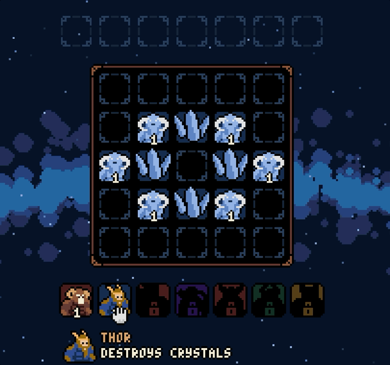

1. Firstly the cursor changes to a "grab" hand when it goes over Thor in order to show that you that this card is draggable.
2. Once your pointer goes down, the cursor changes to a grabbing hand, and the game looks after all of the offset maths required so that the card's position stays the same, relative to the cursor.
3. When the cursor makes it to the board there are checks to see whether there's an empty slot under the cursor and if so, snap the card's position to the slot to show that's where they will be played if you let go right now. During this step the game also evaluates the types of cards that the dragged card can target, in order to show a subtle dotted outline around them, so you have some idea of what's about to happen.
4. If you release the cursor outside the board, or on an occupied tile, then the card animates smoothly back to their original position within the hand.

If you've designed these interactions into the model from the beginning, they don't take up huge amounts of code, but they are fiddly and particularly prone to messy edge cases.

Drawing my own cursors instead of using the browser's defaults is partly an aesthetic preference (like with fonts) but it also gives me the sprites that I need to build in simple tutorials that help players pick up the basic idea without a wall of text.

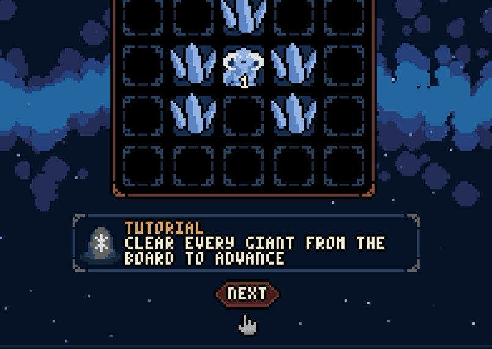

Another small change that made a huge difference to how the game feels is the decision to have the reset button cause cards to animate back to their starting positions, instead of just jumping immediately back to the initial puzzle state.

The narrative is a very small part of the overall game, but ever since I played [Hades](https://www.supergiantgames.com/games/hades/) I've had a real itch to try and add life to the characters in my games through dialogue and an evolving narrative. I don't often see dialogue in JS13K submissions unless the game is primarily story focused, so I was pleased to get something that resembles a basic script into a game that otherwise feels like a puzzle.

Video games have an incredible ability to tell stories, but "The giants took the Gjallarhorn" will not go down as a particularly good one and that's fine. The characters have some basic identities, there are a few breadcrumbs that suggest what's really going on, and there's even a little twist at the end.

There's a lot of "juice" sprinkled (splattered?) throughout the game, which also helps with creating that sense of polish. When a card attacks, there's a bump animation, a red flash to indicate damage and some blood particle effects that fire out in the direction of attack. If the target dies, then they animate to the grave pile, leaving behind a small burst of bouncing bone particles. If you hover over a button, it highlights. If you press down, it depresses by one pixel.

Heck, I even had enough space left at the end to in a the game's logo to the spritesheet and build a title screen! That's a level detail that even my most polished games rarely see!

## Odds and Ends

I made a few changes on the structual end of my game this year. I recognise that build tooling is an integral part of a size constrained game jam, but I'm pretty fed up with the state of JavaScript build tools, so they're an entirely optional part of my game.

If you check out the repo, you can point any web server at the `game` directory (e.g. `python -m http.server game`) without so much as an `npm install`. Historically, this was always possible but it meant giving up some fairly important features, like modules and type safety. These days that's no longer the case, with browser's supporting ES modules natively and TypeScript supporting an entire alternate JSDoc based syntax. Everything in the game is fully typed and checks without errors in strict mode.

Here are the byte counts for the files in that directory in their unminified and uncompressed form.

```
 9776 audio.js
47336 game.js
 5382 graphics.js
   46 index.html
 7022 ragnarok.mid
 2719 sprites.js
 2631 sprites.png
 4228 utils.js
79140 total
```

80KB! That's an 83% compression rate by the time it's zipped. Minification does some heavy lifting, but I think I managed to pack a lot more into this year's game than ever before because I just have a better understanding of how the compression algorithms work, than I did in the past. I also have a much better understanding of what Terser can optimise away, what it can mangle, and how to write code that's going to be eliminated or constant folded.

I have some mixed feelings about [roadroller](https://github.com/lifthrasiir/roadroller/) and despite seeing some overall savings, I decided not to use it as part of my build tooling. I love pulling up the minified source of a game and looking for patterns and tell-tale signs of various web APIs, or bitwise wizardry, or otherwise unconventional programming styles. I know the source has to be available as part of JS13K, but roadrolling your code kinda just makes it that bit more closed and opaque.

And last but not least, I decide to track the size of my game alongside every commit I made throughout the month, using `git notes`. Hands up if you didn't know `git notes` were a thing! The rationale here was that it would make it much easier for me to identify the features that actually added the most bloat to the code by looking for the heavy commits. A neat side effect is that now I can visualise exactly how the game grew throughout the month.

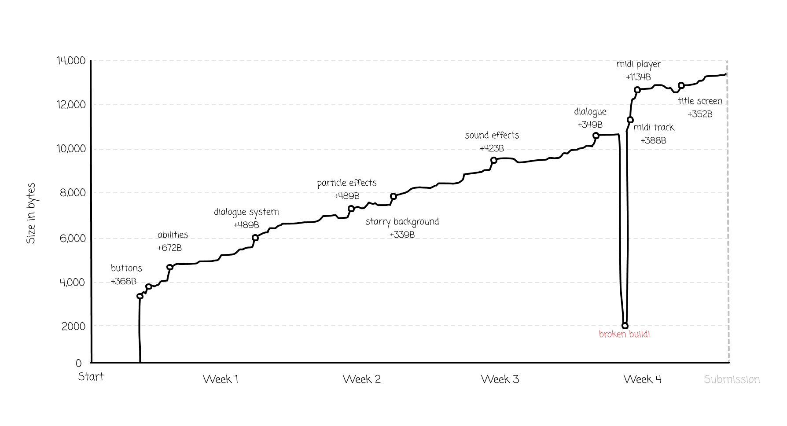

My repository has a post commit hook that builds and measures the source, then attaches the measurement to the most recent commit with a git note. This was easy enough to set up, but I tend to build big then commit surgically, and having untracked files as part of the build means that the measurements don't accurately reflect the state of the repository at the time of the commit. I tried working around this with `git stash -u` but that caused its own headaches and I ended up using `git archive` (who knew?) to create a separate copy of the repo where I could safely measure the build in isolation.

<details>
<summary>Here are the commits that changed the size of the zip by at least 100 bytes in chronological order, with the worst offenders highlighted in bold.</summary>

| Commit                                                                                                                 |       Delta |
| ---------------------------------------------------------------------------------------------------------------------- | ----------: |
| [`11f0b0d`](https://github.com/danprince/gjallarhorn/commit/11f0b0d) adds card animations                              |      +132 B |
| [`7de3e37`](https://github.com/danprince/gjallarhorn/commit/7de3e37) adds buttons                                      |  **+368 B** |
| [`7da1258`](https://github.com/danprince/gjallarhorn/commit/7da1258) adds cursors                                      |      +141 B |
| [`264338d`](https://github.com/danprince/gjallarhorn/commit/264338d) actions                                           |  **+672 B** |
| [`7d5f28f`](https://github.com/danprince/gjallarhorn/commit/7d5f28f) adds card tooltips                                |      +267 B |
| [`31e09d7`](https://github.com/danprince/gjallarhorn/commit/31e09d7) adds primitive mobile support                     |      +104 B |
| [`bd1f9d0`](https://github.com/danprince/gjallarhorn/commit/bd1f9d0) adds the dialogue system                          |  **+489 B** |
| [`e5679b6`](https://github.com/danprince/gjallarhorn/commit/e5679b6) adds a level editor                               |      +209 B |
| [`d021dce`](https://github.com/danprince/gjallarhorn/commit/d021dce) adds first batch of levels                        |      +119 B |
| [`02be963`](https://github.com/danprince/gjallarhorn/commit/02be963) include chaos giants in random levels             |      +164 B |
| [`c7d15e7`](https://github.com/danprince/gjallarhorn/commit/c7d15e7) extract perform logic and simplify unused effects |      -135 B |
| [`dda0f8b`](https://github.com/danprince/gjallarhorn/commit/dda0f8b) adds basic particle effects                       |  **+470 B** |
| [`f11d4bb`](https://github.com/danprince/gjallarhorn/commit/f11d4bb) use nine patch for rendering buttons              |      +179 B |
| [`919daaa`](https://github.com/danprince/gjallarhorn/commit/919daaa) adds starry background                            |  **+339 B** |
| [`1a1a926`](https://github.com/danprince/gjallarhorn/commit/1a1a926) adds runestones                                   |      +112 B |
| [`7cff36a`](https://github.com/danprince/gjallarhorn/commit/7cff36a) adds a new batch of levels                        |      +132 B |
| [`f8983d0`](https://github.com/danprince/gjallarhorn/commit/f8983d0) unify levels and story                            |      +238 B |
| [`a6f7aad`](https://github.com/danprince/gjallarhorn/commit/a6f7aad) adds a basic tutorial to the first level          |      +105 B |
| [`440c303`](https://github.com/danprince/gjallarhorn/commit/440c303) adds basic sound fx                               |  **+423 B** |
| [`7723235`](https://github.com/danprince/gjallarhorn/commit/7723235) changes to tutorial dialogue                      |      -122 B |
| [`011c612`](https://github.com/danprince/gjallarhorn/commit/011c612) rework runestones to be gjallarhorn               |      +194 B |
| [`fa685fa`](https://github.com/danprince/gjallarhorn/commit/fa685fa) dialogue tweaks                                   |      +151 B |
| [`084e677`](https://github.com/danprince/gjallarhorn/commit/084e677) render rainbow arcs after level complete          |      +179 B |
| [`61913c9`](https://github.com/danprince/gjallarhorn/commit/61913c9) adding dialogue                                   |  **+349 B** |
| [`7d85e4c`](https://github.com/danprince/gjallarhorn/commit/7d85e4c) move game files into their own dir                | **-8584 B** |
| [`24ab822`](https://github.com/danprince/gjallarhorn/commit/24ab822) fix vite output dir                               | **+8686 B** |
| [`510c706`](https://github.com/danprince/gjallarhorn/commit/510c706) adds ragnarok midi                                |  **+388 B** |
| [`b416de1`](https://github.com/danprince/gjallarhorn/commit/b416de1) add midi player and instruments                   | **+1134 B** |
| [`d6a1fc0`](https://github.com/danprince/gjallarhorn/commit/d6a1fc0) song tweaks                                       |  **+343 B** |
| [`f723e31`](https://github.com/danprince/gjallarhorn/commit/f723e31) more tweaks to the music                          |      +165 B |
| [`2e46b80`](https://github.com/danprince/gjallarhorn/commit/2e46b80) remove level generation logic                     |      -106 B |
| [`8a30e30`](https://github.com/danprince/gjallarhorn/commit/8a30e30) trimming down on the less fun puzzles             |      -194 B |
| [`6ee3df9`](https://github.com/danprince/gjallarhorn/commit/6ee3df9) adds a title screen                               |  **+352 B** |
| [`5d2631f`](https://github.com/danprince/gjallarhorn/commit/5d2631f) final pass over dialogue                          |      +113 B |
| [`8d8f843`](https://github.com/danprince/gjallarhorn/commit/8d8f843) adds bonus puzzles after the story                |      +219 B |

</details>

All in all, it feels like 13KB well spent, on a game that I would have genuinely enjoyed playing. I'm very happy with this entry. I'd be surprised if it does all that well in the competition, because the links to the theme are pretty tenuous, and the difficulty spikes definitely caught some of the play testers off guard in ways that I wasn't expecting. In the end, I'm just happy to submit something that doesn't look or feel like it was squeezed out of a tiny budget!

## Handmade Disclaimer

Every puzzle, every line of code, every note of MIDI, and every pixel of artwork was hand made by a clumsy human. There will be bugs, there will be mistakes, but _I_ made this and I'm proud of it.

This was the most fun I've had with a creative project for quite a long time because a jam like this represents a window of color (pun not intended) in a world otherwise turning AI grey.

I strongly debated putting this statement in with the submission itself but I don't want people's impression of my game to be tainted by my grumpy opinions about AI.

## Acknowledgements

Thank you to Anna, whom I love dearly, for her curiosity and patience!

Thank you to Ed, Noah, Sam, the other Noah, and Jeff for trying out and giving feedback on early versions of the game.

Thank you to Andrzej and everyone else who keeps JS13K going strong, even after all these years!

And thank you, dear reader, for making it to the end!
